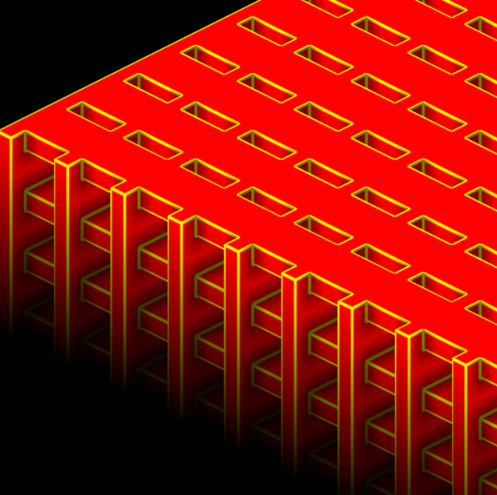
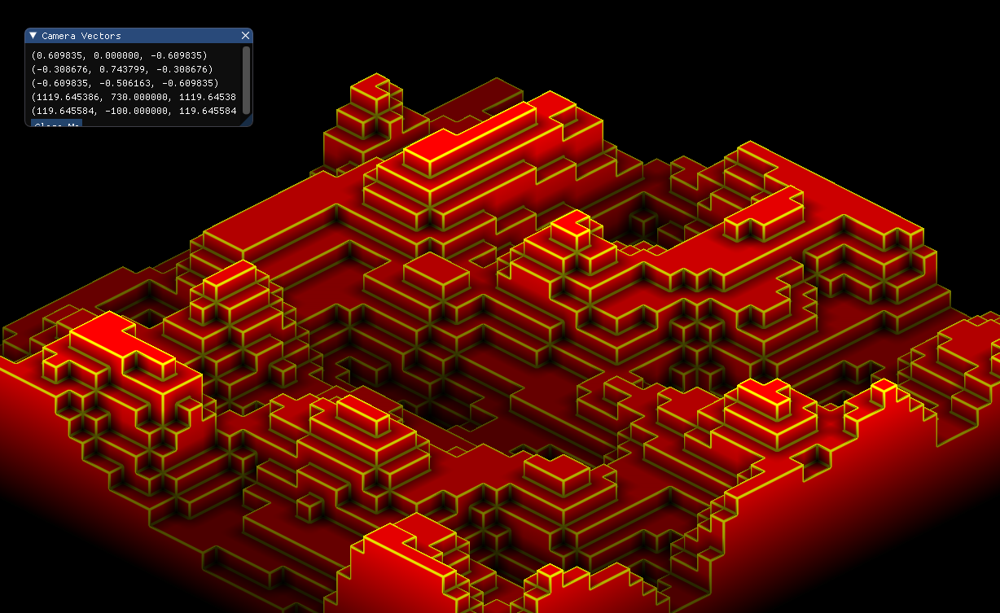

# Isometric-GPU-Voxel-Raytracer

A parking lot looking building rendered from my engine.

[Video demo with voxel selection via raycasting the mouse](https://youtu.be/5lf5ftyHCI8)

Simple noise. Algorithm found from [scratchapixel](https://scratchapixel.com);

Using:
- ModernGL for the OpenGL interface
- PyGame for window and context creation

Design decisions:
Q: Why Python?
A: It is a simple high-level language. My output is much faster when I code in Python, which is important for keeping me motivated on larger projects. If this graphics engine starts developing into an actual game, I'll start porting it over to C++ (Oct 25, 2018: I have now ported it to C++ in hopes of making a full game out of this. Because of this I will no longer update this repo, but I will keep it up for those who want to see a simple voxel raytracing shader). Also, the big meat of the code is in GLSL, so the slowness of Python is not really a bottleneck.

Q: Why Isometric?
A: It looks better for the type of game I'm trying to make.